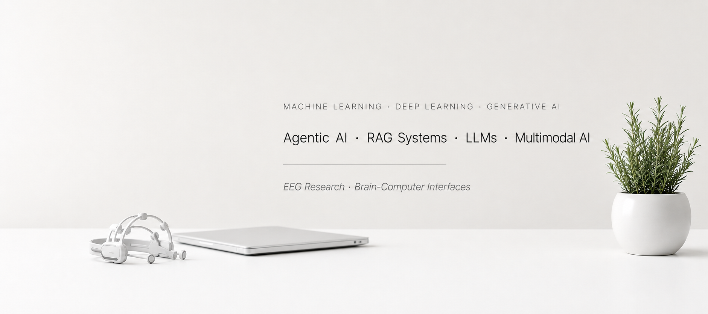

<!-- COVER BANNER -->
<div align="center">
  
</div>

<br/>

<!-- HEADER -->
<div align="center">

# Himasagar Ullamgunta

`ML/AI Engineer` &nbsp;·&nbsp; `Python` &nbsp;·&nbsp; `PyTorch` &nbsp;·&nbsp; `LangGraph` &nbsp;·&nbsp; `FastAPI`

*Designing and building machine learning systems — from model training to production APIs.*

[](https://github.com/HimasagarU)
&nbsp;
[](mailto:himasagar.evo@gmail.com)

</div>

<br/>

---

## &nbsp; About Me

```yaml
focus    : Agentic AI · Recommender Systems · NLP/LLMs · Multimodal Learning
research : EEG-based attention classification · cross-subject biomarker discovery
pipeline : data ingestion → model inference → REST API → production
interests: LangGraph agents · RAG systems · Graph Neural Networks · Signal Processing
location : Chennai, Tamil Nadu, India
```

<br/>

---

## &nbsp; Tech Stack

**Languages**


**ML / DL / AI**


**Agentic & LLM Frameworks**


**Backend & APIs**


**Frontend**


**Databases & Storage**


**Tools & Deployment**


<br/>

---

## &nbsp; GitHub Stats

<div align="center">

[](https://github.com/HimasagarU)
&nbsp;&nbsp;
[](https://github.com/HimasagarU)

<br/>

[](https://github.com/HimasagarU)

</div>

<br/>

---

## &nbsp; Featured Projects

### Agentic AI & LLM Systems

| Project | Description | Stack |
|:--------|:------------|:------|
| [**LangGraph-ReAct-Reasoning-Agent**](https://github.com/HimasagarU/LangGraph-ReAct-Reasoning-Agent-Tool-Augmented-AI-System) | Tool-augmented reasoning agent using LangGraph ReAct loop with intent classification, multi-step reasoning, and a self-critique review pass. Supports Tavily search, Wikipedia lookup, and calculator tools. SSE streaming + FastAPI frontend. | `Python` `LangGraph` `LangChain` `Groq` `Tavily` `FastAPI` |
| [**Arxiv-RAG-Assistant**](https://github.com/HimasagarU/Arxiv-RAG-Assistant) &nbsp; [](https://arxiv-rag-assistant.vercel.app) | RAG system for mechanistic interpretability research. Hybrid retrieval (dense + BM25 + RRF + reranking), intent-aware generation, full-text ArXiv paper ingestion. | `Python` `FastAPI` `BM25` `Qdrant` `Llama 3` |

### Recommender Systems & Multimodal AI

| Project | Description | Stack |
|:--------|:------------|:------|
| [**FasRec-AI-Engine**](https://github.com/HimasagarU/FasRec-AI-Engine) &nbsp; [](https://fas-rec-ai-engine.vercel.app) | Production-grade fashion recommendation platform for 44k+ products. SigLIP vision embeddings, BGE text embeddings, FAISS HNSW ANN, RRF fusion, LLaMA 3.3-70B outfit styling. FastAPI + React + Supabase. | `SigLIP` `BGE` `FAISS` `LLaMA 3.3-70B` `FastAPI` `React` `Supabase` |
| [**Simple-Arxiv-Paper-Recommender**](https://github.com/HimasagarU/Simple-Arxiv-Paper-Recommender) | NLP prototype recommending related arXiv papers via TF-IDF and embedding-based abstract similarity. | `Python` `NLP` `TF-IDF` |
| [**Simple-Fashion-Recommendation-System-Phase1**](https://github.com/HimasagarU/Simple-Fashion-Recommendation-System-Phase1) | Content-based fashion recommender using K-Means clustering on product attributes and image features. | `Python` `K-Means` |

### Data Engineering & ML Pipelines

| Project | Description | Stack |
|:--------|:------------|:------|
| [**Loan-Collections-Recovery-Engine**](https://github.com/HimasagarU/Loan-Collections-Recovery-Engine) | End-to-end SQL + ML pipeline on the Home Credit dataset. Warehouse design (staging → dims → facts → marts), delinquency feature engineering, recovery propensity scoring with LightGBM, Power BI exports. | `Python` `PostgreSQL` `SQLAlchemy` `LightGBM` `scikit-learn` |

### EEG & Signal Processing

| Project | Description | Stack |
|:--------|:------------|:------|
| [**AttentionEEG**](https://github.com/HimasagarU/AttentionEEG) | Attention classification across multimodal EEG stimuli (audio, video, text). | `Python` `MNE` `Scikit-learn` |
| [**Modality-Invariant Biomarker Discovery**](https://github.com/HimasagarU/Modality-Invariant-Biomarker-Discovery-for-Attention-using-EEG) | Identifying stable EEG biomarkers for attention that generalize across audio, video, and text modalities. | `Python` `EEG` `Signal Processing` |

### Graph Neural Networks

| Project | Description | Stack |
|:--------|:------------|:------|
| [**DbPedia Entity Classification**](https://github.com/HimasagarU/DbPedia-Enitity-Classification-using-GCNs-and-GraphSage) | Multiclass text classification on DBpedia-14 using GCN and GraphSAGE architectures. | `Python` `PyTorch Geometric` |

### Computational Biology

| Project | Description | Stack |
|:--------|:------------|:------|
| [**Protein Remote Homology Detection**](https://github.com/HimasagarU/Protein-Remote-Homology-Detection-by-Sequence-Embeddings-Alignment) | Remote protein homolog detection via ESM-2 sequence embedding alignment and Smith-Waterman scoring. | `Python` `ESM-2` |

### Web & Full-Stack

| Project | Description | Stack |
|:--------|:------------|:------|
| [**EstateCraft**](https://github.com/HimasagarU/EstateCraft) | Full-stack MERN platform for property listings with Stripe payments and role-based auth. | `React` `Redux` `Node.js` `MongoDB` `Stripe` |
| [**NourishNest**](https://github.com/HimasagarU/NourishNest) | Nutrition and diet planning platform with recipe database and meal tracking via Spoonacular API. | `Node.js` `Express` `MongoDB` |
| [**Smart-Scheduler**](https://github.com/HimasagarU/Smart-Scheduler) | Context-aware task scheduling assistant. | `Python` `JavaScript` |
| [**Smart-Pg-Review-Platform**](https://github.com/HimasagarU/Smart-Pg-Review-Platform) | PG accommodation review and discovery platform. | `TypeScript` |

### Security

| Project | Description | Stack |
|:--------|:------------|:------|
| [**CSRF Attack & Defense Demo**](https://github.com/HimasagarU/csrf-attack-defense-demo) | Demonstrates CSRF vulnerability and OWASP-compliant defense mechanisms. | `Node.js` `EJS` |

<br/>

---

<div align="center">
  <sub>Built with curiosity. Deployed with purpose.</sub>
</div>
